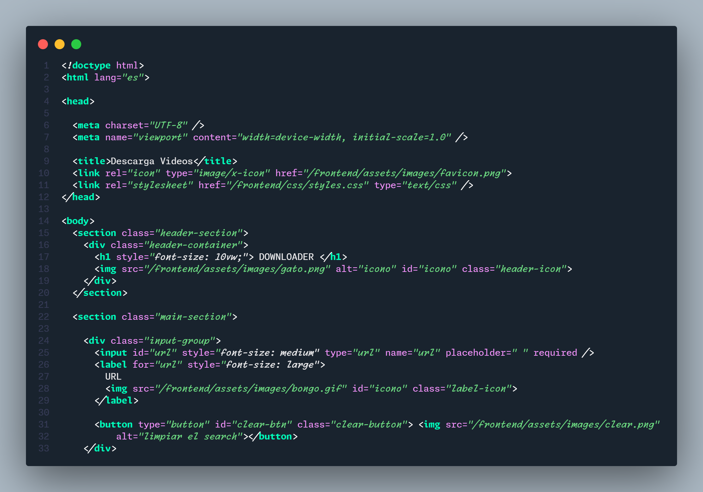
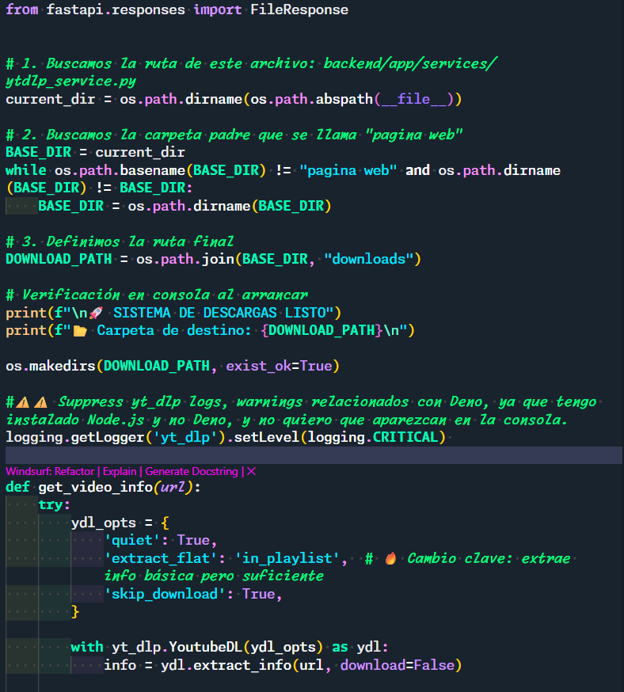
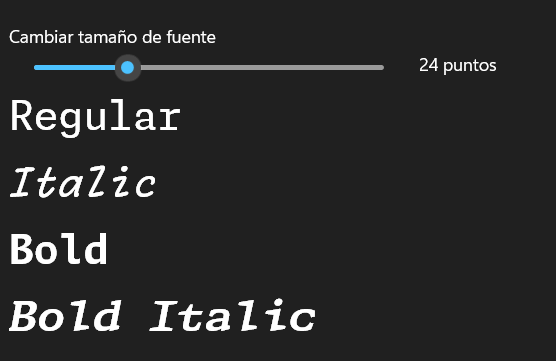
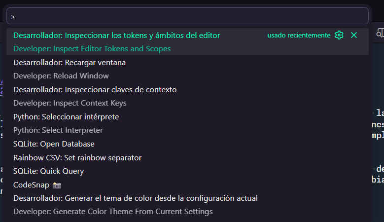

# Monaspace Remix: NeiberFonts 🚀

**Monaspace Remix (NeiberFonts)** es una familia de fuentes tipográficas híbrida diseñada para maximizar la legibilidad y la estética en entornos de desarrollo. A diferencia de las familias tradicionales donde los estilos (*Italic*, *Bold*) son solo variaciones de peso de la misma tipografía, este proyecto utiliza una **fusión por metadatos** realizada en **FontForge** para enlazar 4 fuentes completamente distintas y diferenciables bajo un mismo nombre.

La magia de **NeiberFonts** se activa mediante la configuración del archivo de preferencias (como el `.json` de tu editor de código). Al asignar estilos específicos a diferentes elementos sintácticos (como comentarios o palabras clave), el editor no solo cambia el peso del texto, sino que intercambia la fuente por una familia visualmente diferente en tiempo real.

---

## 🛠️ Arquitectura de la Familia Tipográfica

El proyecto consta de **4 archivos de fuentes** enlazados internamente mediante metadatos para funcionar en perfecta sincronía dentro de tu editor:

| Estilo del Sistema | Fuente Real Asignada | Propósito Sugerido en el Editor |
| :--- | :--- | :--- |
| **Normal (Regular)** | **Argon** | Fuente base por defecto para el cuerpo general del código. |
| **Italic** | **Xenon** | Aplicado a **comentarios**. Cambia a una fuente completamente diferente y muy diferenciable del resto. |
| **Bold** | **Radon** | Aplicado a **palabras clave o funciones**, otorgando un resalte estructural único. |
| **Bold Italic** | **Krypton** | Variante híbrida para casos especiales de sintaxis avanzada o variables clave. |

---

## 🎨 Colores y Tipografía

| HTML | Python | Tipografía |
| :---: | :---: | :---: |
|  |  |  |

## 🚀 Instalación y Configuración

### 1. Instalación de las Fuentes

Para disfrutar de la experiencia híbrida, debes instalar los 4 archivos en tu sistema para que actúen como una sola familia:

1. Descarga los 4 archivos de fuente desde la carpeta `fonts/` de este repositorio.
2. Instálalos en tu sistema operativo (en Windows: clic derecho e "Instalar para todos los usuarios"; en macOS: añadir al Catálogo Tipográfico).

### 2. Configuración en el Editor (Ejemplo para VS Code)

Una vez instaladas, la segmentación visual se logra editando el archivo de configuración `settings.json`.

Por ejemplo, para activar **Argon** por defecto y hacer que los comentarios adopten la fuente **Xenon** automáticamente mediante el estilo *Italic*, añade lo siguiente a tu `.json`:

Puedes usar este archivo como referencia, no olvides cambiar la linea del tema que esta utilizando, en mi caso es el Aura Soft Dark:

los tokens se pueden obtener inspeccionando el editor mediante las opciones de desarrollador: inspeccionar los tokens y ámbitos del editor. Lo encuentras usando ctrl + shift + p, luego buscas "inspect"

|tokens options|
| :---: |
|  |

### 3. Configuración en el Editor

revisa la carpeta de resources en la que encontraras un ejemplo de como yo lo hice, recuerda que el código se escribe en el settings.json de tu editor
